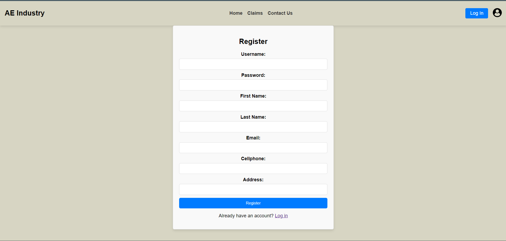
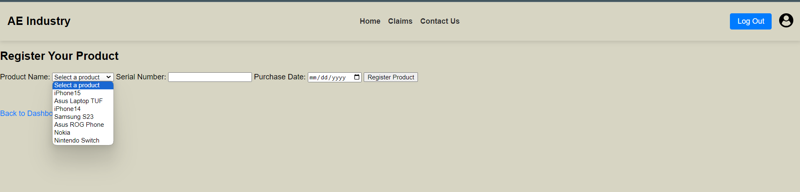
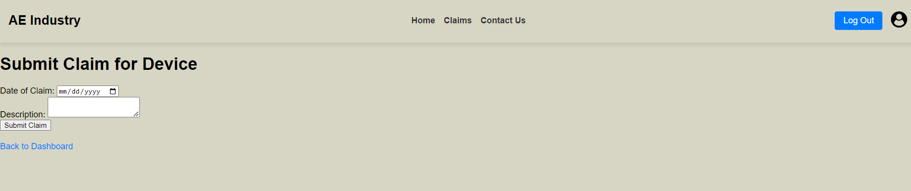
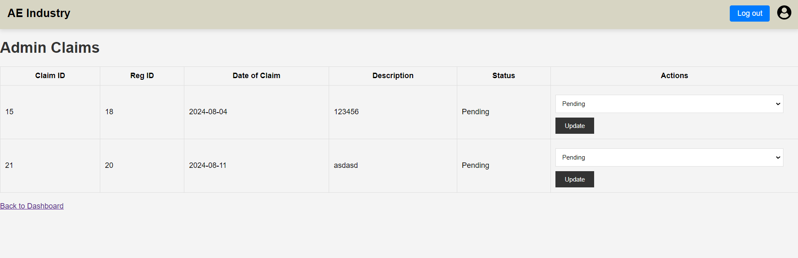
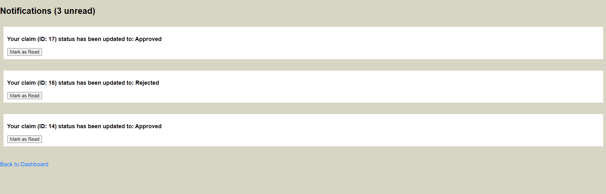
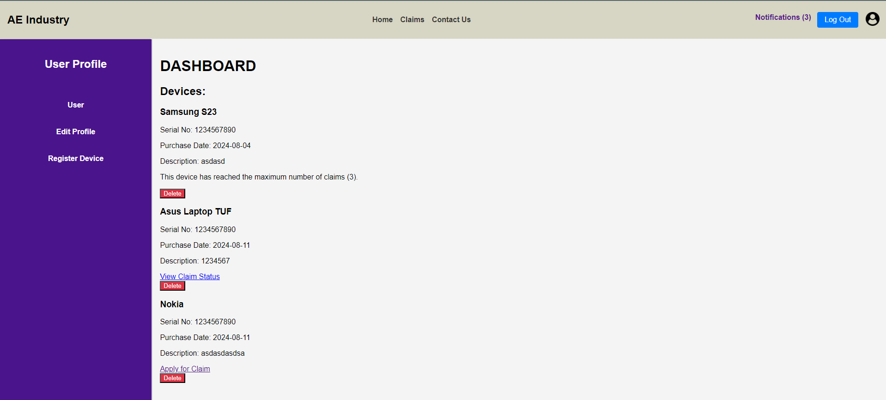
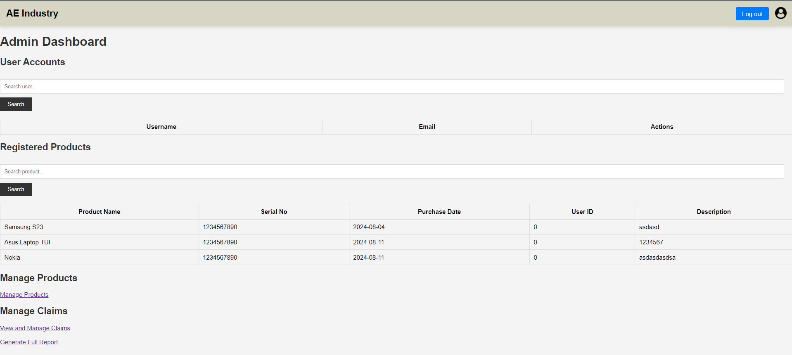

# Digital Device Protection Plan Management System

## Overview

The **Digital Device Protection Plan Management System** is a Java-based web application designed to manage digital device protection plans efficiently. Users can register their devices, submit claims, and track the status of their claims. Admins have the ability to manage claims, including approving or rejecting them. The system enforces a maximum of three claims per device over a five-year protection period.

## Features

### 1. User Registration and Login
Secure user authentication and registration process.

  


### 2. Device Registration
Users can register their devices to be covered under the protection plan.

  


### 3. Claim Submission
Users can submit claims for device repair or replacement.

  


### 4. Claim Management
Admins can approve or reject claims, and users can view the status of their claims.

  


### 5. Notifications
Users receive notifications regarding the status of their claims.

  


### 6. Protection Plan Enforcement
The system enforces the protection plan rules, including the three-claim limit over five years.

  


## Security Features

- **Session Management**: Ensures that users and admins are properly authenticated. Sessions are invalidated on logout to prevent unauthorized access.
- **Input Validation**: All user inputs are validated on both the client and server sides to prevent SQL injection and other malicious inputs.
- **Admin Account Creation Protection**: Only authorized personnel can create admin accounts by requiring a secure token, which is stored in a server environment variable. This token must be provided during the admin registration process to prevent ordinary users from creating admin accounts.
- **Role-Based Access Control**: Differentiates between admin and user roles to restrict access to admin functionalities.
- **SQL Injection Prevention**: Prepared statements are used for all database queries to protect against SQL injection attacks.

## Technologies Used

- **Java**: Core programming language for the application.
- **JSP**: JavaServer Pages used for the frontend view.
- **Servlets**: Used for handling requests and responses between the frontend and backend.
- **JSTL**: JavaServer Pages Standard Tag Library used for easier JSP development.
- **MySQL**: Database used for storing user, device, and claim information.
- **HTML/CSS**: Used for creating and styling the user interface.
- **JavaScript**: For client-side validation and dynamic content.

## Project Structure
src/main/


  &ensp;java/

  
  &emsp;&emsp;controller/

  
  &emsp;&emsp;dao/

  
  &emsp;&emsp;model/

  
 &ensp;webapp/


  &emsp;&emsp;WEB-INF/

  
  &emsp;&emsp;css/

  
  &emsp;&emsp;images/

  
  &emsp;&emsp;jsp/

## Getting Started

1. **Clone the Repository**: 
    ```bash
    git clone https://github.com/YourUsername/Digital-Device-Protection-Plan-Management-System.git
    ```

2. **Setup the Database**: 
   - Import the MySQL database schema provided in the `/db` directory.
   - Update the database configuration in the `DatabaseConnection.java` file.

3. **Run the Project**:
   - Deploy the project on an Apache Tomcat server.
   - Access the application via `http://localhost:8080/YourProjectName`.

## Screenshots

### Dashboard
  


### Claim Submission
  


### Admin Claims and Device Management
  


## Future Enhancements

- **Email Notifications**: Integrate email notifications for claim updates.
- **Report Generation**: Add functionality for generating reports for admins.
- **Mobile Responsiveness**: Enhance the UI for better mobile device compatibility.
